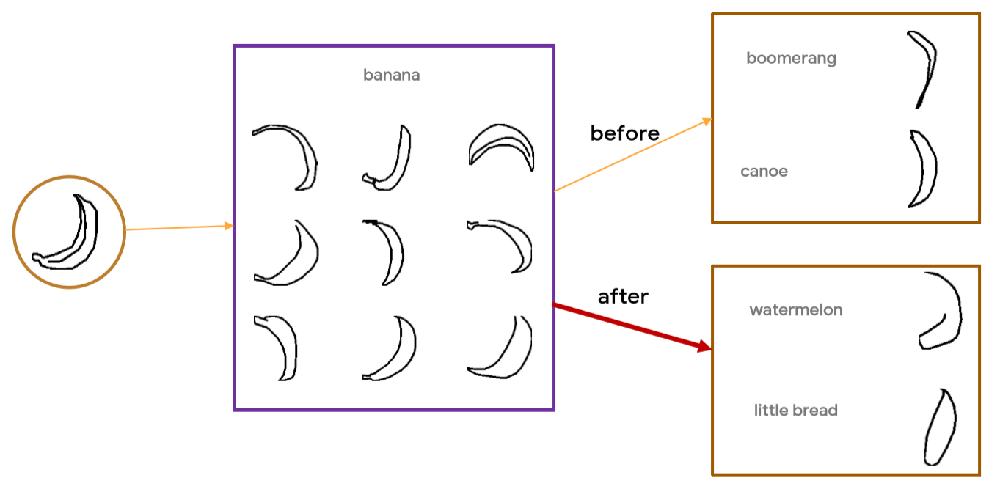
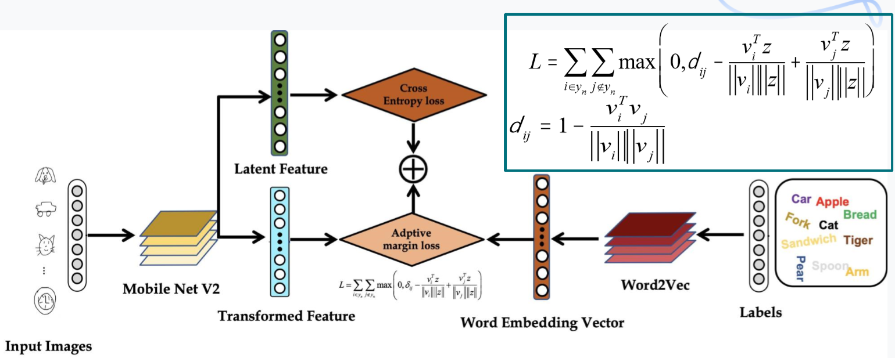
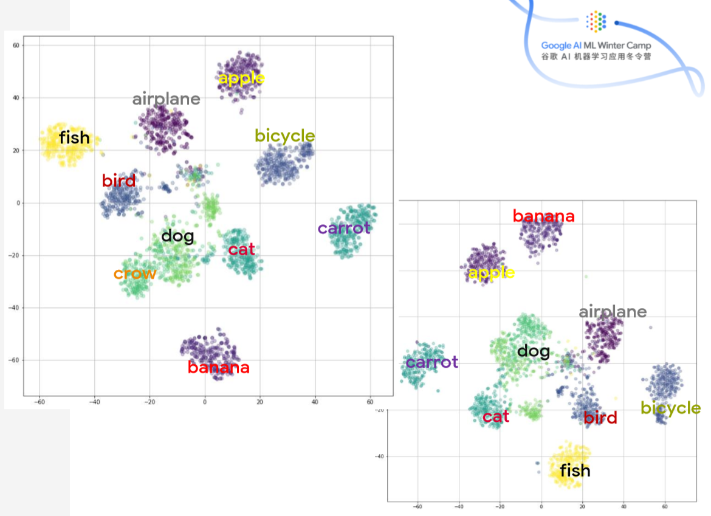
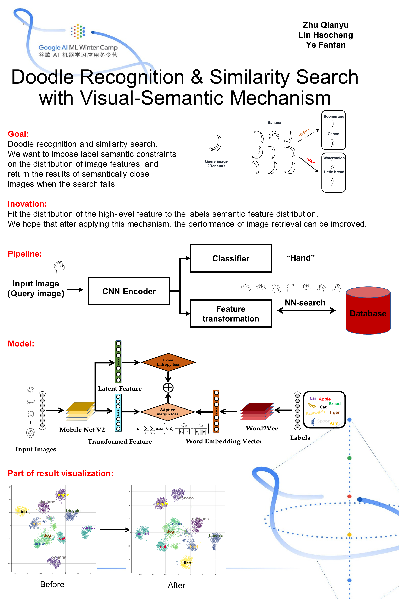

#### Project of Team ZJU in Google AI ML Winter Camp Shanghai
14 - 18 January, 2019

Team Members: Fanfan Ye & Haocheng Lin & Qianyu Zhu, Zhejiang University

Our project won the final ***Most Innovative Project Award*** . 

[Click here to see Google AI ML Winter Camp Shanghai live photo](https://live.photoplus.cn/activity/live/pc/7901062/#/)

## Doodle Recognition & Similarity Search with Visual-Semantic Mechanism

We want to impose label semantic constraints on the distribution of image features, so that we can do Similarity Search with Visual-Semantic Mechanism while completing Doodle Recognition, and return the results of semantically close images when the search fails.
This can also be considered as a multi-task learning.
Instead of directly extracting features from the image and then matching the features to make a map search, we want the encoder to take the semantic information of the image tag into account when encoding. 
(We think it makes sense to do this in some specific scenarios, and doing so should improve the accuracy of the search.)

    

Below is the whole pipeline designed by us.
First, the label of all the images to be retrieved is encoded by the word vector, and then the CNN is used to encode the image. Then we want the CNN feature to be close to the feature of the current tag word vector. After the training, we use the feature nearest neighbor to retrieve it.
The following is a block diagram of our model used to weigh the performance and computational complexity of image coding.

    

Because we are doing multitasking, there are two branches here.
One branch is for image recognition, and the other is used to encode the image so that the encoded feature distribution conforms to the distribution of the tag semantics.
The loss function indicates that the distance of the feature vector of the current image is larger than the cosine distance of the tag word vector of all other different images.
The distance from the word vector of the image tag corresponding to the current image, that is, Margin.
The margin value is not fixed. It's calculated based on the distance between the current tag word vector and other tag word vectors.
The result of such learning enables the distribution of the feature vectors encoded by the encoder to conform to the distribution of the word vector features.
Finally, we use the hash image retrieval method for image retrieval.

    

We visualized the two different results separately. The left is with the addition of adaptive loss and the right is without adaptive loss.
It can be seen from the figure that the spatial distribution of the image features with the addition of adaptive loss is closer to the distribution of the semantic features of the tags.

However, due to the limited time, we didn't make a measure of the average accuracy of image retrieval. In addition, we didn't experimented with our mechanism on other datasets to see if it can affect the performance of the search.
 
 
[Slides](https://drive.google.com/file/d/1A02jde9k0vD2ZQ_mSL0iN5BeoQUrGggq/view?usp=sharing) and [Poster](https://drive.google.com/file/d/10K-gTxJXyQzi57ooWOy7AUR4O_KodnGZ/view?usp=sharing) are available in Google Drive.

#### References
Yue Cao, Mingsheng Long, Jianmin Wang, and Shichen Liu. "Deep Visual-Semantic Quantization for Efficient Image Retrieval". 10.1109/CVPR.2017.104 

    

